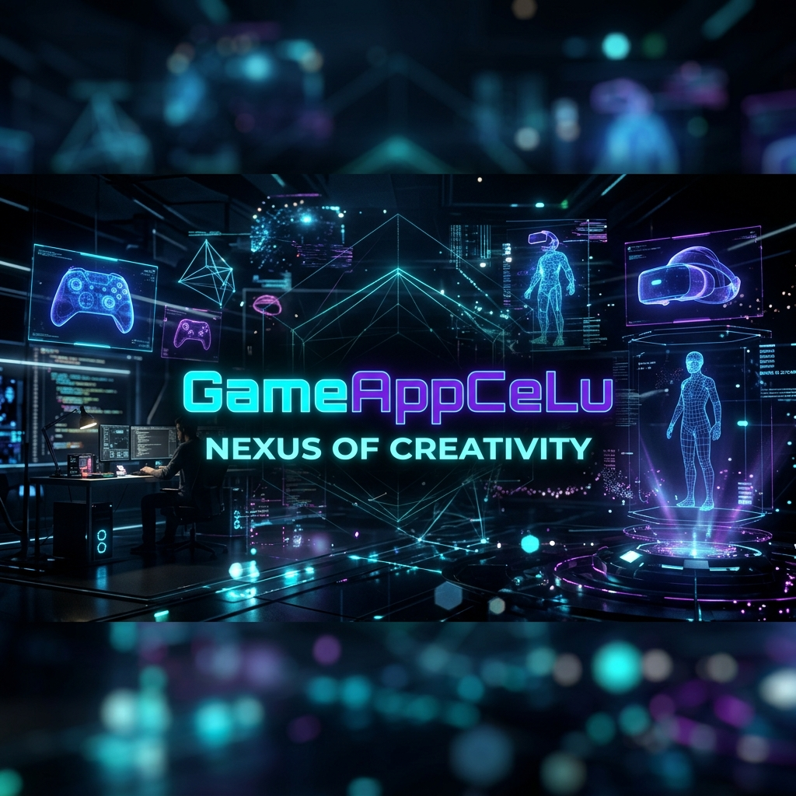
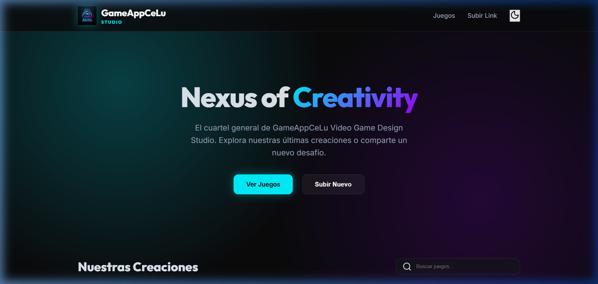

# GameAppCeLu | Video Game Design Studio



> **"Nexus of Creativity"** - El cuartel general interactivo para el diseño y distribución de videojuegos independientes.

---

## 🌐 Live Portal
Accede a la versión en vivo: **[gameappcelu.netlify.app](https://gameappcelu.netlify.app/)**

---

## 🚀 Sobre el Proyecto
**GameAppCeLu Hub** es una plataforma web de vanguardia diseñada para centralizar y compartir los proyectos de videojuegos del estudio. Con una estética futurista y de alto rendimiento, el portal sirve como puente entre los creadores y los jugadores, ofreciendo un acceso directo a experiencias como **Card Battle Universe**.

### ✨ Características Principales
- 🌑 **Estética Modern-Dark**: Interfaz de alta fidelidad con efectos de glassmorphism y acentos neón.
- 🎮 **Galería Dinámica**: Sistema de visualización de juegos con tarjetas interactivas y efectos de hover.
- 🛠️ **Portal Administrativo**: Acceso restringido para la publicación rápida de nuevos enlaces y proyectos.
- 📱 **Diseño Responsive**: Optimización total para dispositivos móviles y escritorio.
- 🔍 **Búsqueda Avanzada**: Filtro en tiempo real para localizar proyectos instantáneamente.

---

## 💻 Tech Stack
| Tecnología | Uso |
| :--- | :--- |
| **HTML5** | Estructura semántica avanzada |
| **CSS3** | Diseño personalizado, CSS Variables, Glassmorphism |
| **JavaScript (ES6+)** | Lógica de filtrado, manejo de modal y estado dinámico |
| **Lucide Icons** | Iconografía minimalista y escalable |
| **Google Fonts** | Tipografía premium (Inter & Outfit) |

---

## 📸 Vista Previa


---

## 🛠️ Configuración Local
Si deseas ejecutar este hub en tu entorno local:

1. Clona este repositorio:
   ```bash
   git clone https://github.com/tu-usuario/GameAppCeLu.git
   ```
2. Abre el archivo `index.html` en tu navegador preferido.
3. *Opcional*: Para una mejor experiencia, usa una extensión de Live Server (como la de VS Code).

---

## 👤 Autor
**GameAppCeLu Design Studio**
*Diseñando el futuro de los videojuegos.*

---
© 2026 GameAppCeLu Video Game Design Studio. Todos los derechos reservados.
